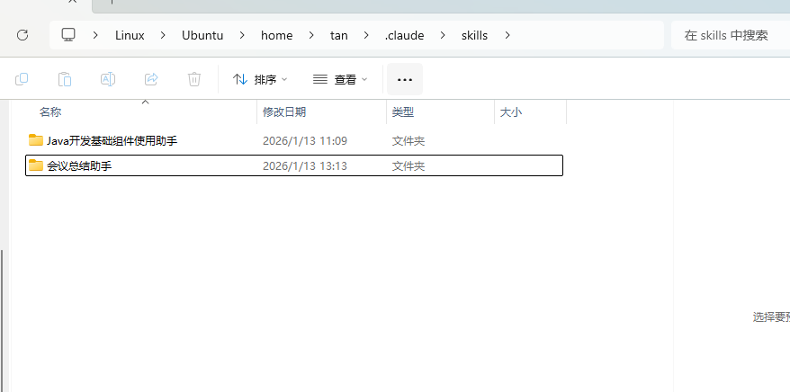
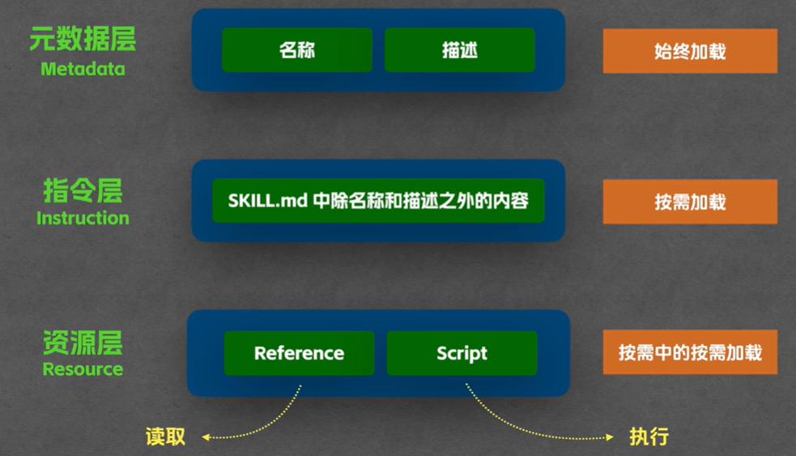
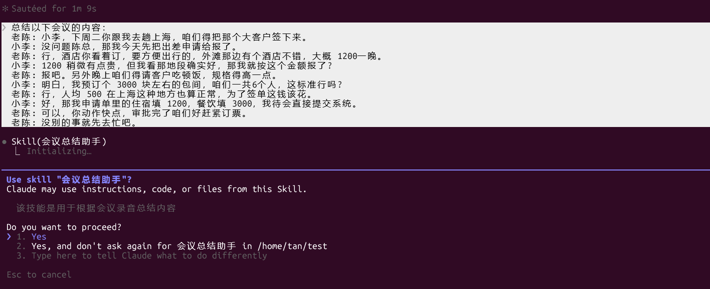
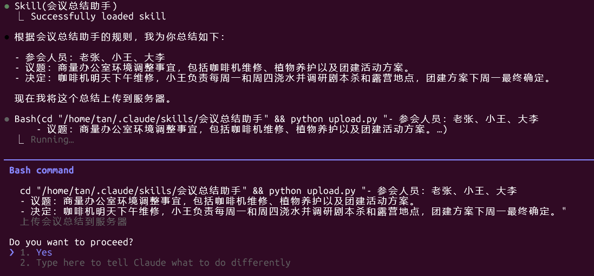

# 项目说明
> [官方skill文档](https://code.claude.com/docs/zh-CN/skills) 

我的 agent skill 集合


# 如何使用

将助手目录整个文件夹放到 [路径选择](#skills 存放在哪里) 就可以用了

如将 ：`会议总结助手`移动到 `.claude\skills` 




# 什么是 skill
agent skill 就是一个大模型可以随时翻阅的说明文档


## 渐进式披露（Progressive Disclosure)

g


## Skill VS MCP

> https://claude.com/blog/skills-explained

**When to use a Skill instead:** <span style="color:red">MCP connects Claude to data; Skills teach Claude what to do with that data.</span>If you're explaining *how* to use a tool or follow procedures—like "when querying our database, always filter by date range first" or "format Excel reports with these specific formulas"—that's a Skill. If you need Claude to *access* the database or Excel files in the first place, that's MCP. Use both together: MCP for connectivity, Skills for procedural knowledge.

`MCP` 把`Claude` 和`数据`连接起来；`Skill`则教`Claude`如何`利用`这些`数据`


# skill 结构

> 官方建议将 Reference 归类至 references/ 文件夹，Script 归类至 scripts/ 文件夹，以保持结构清晰
>
> - 脚本文件只会被执行不会被读取，这样可以有效的减少token消耗 （cc只关心脚本执行方法和运行结果，不管脚本内容
>   - 构建的时候最好写清楚调用方法和解释清楚用途，要不然如果执行错误可能还是会去看内容
>   - <span style="color:red">适合轻量脚本，复杂的请交给 mcp</span>
> - reference 是读取，会将内容加载到上下文中所以会消耗token

```text
my-skill/
├── SKILL.md (required - overview and navigation)
├── reference.md (detailed API docs - loaded when needed)
├── examples.md (usage examples - loaded when needed)
└── scripts/
    └── helper.py (utility script - executed, not loaded)
```

## 编写 SKILL.md

`SKILL.md` 文件是 Skill 中唯一必需的文件。它有两部分：顶部的 YAML 元数据（`---` 标记之间的部分）和告诉 Claude 如何使用 Skill 的 Markdown 说明：

> [技能创作最佳实践](https://docs.claude.com/zh-CN/docs/agents-and-tools/agent-skills/best-practices)

```md
---
name: your-skill-name
description: Brief description of what this Skill does and when to use it
---

# Your Skill Name

## Instructions
Provide clear, step-by-step guidance for Claude.

## Examples
Show concrete examples of using this Skill.
```

ps: 

- `name` **必须跟文件夹名称相同**
  - 关于命名: Claude Code 实测中文兼容。但在 Claude Desktop 等严格环境下，建议使用小写英文+短横线（如 meeting-summarizer）以确保兼容性

- `description` skill功能描述
- `Instructions`  描述模型需要遵循的规则
- `Examples` 示例

## SKILL.md属性字段说明

>  关于命名: Claude Code 实测中文兼容。但在 Claude Desktop 等严格环境下，建议使用小写英文+短横线（如 meeting-summarizer）以确保兼容性

| 字段           | 必需 |                             描述                             |
| -------------- | ---- | :----------------------------------------------------------: |
| name           | 是   | Skill 名称。必须仅使用小写字母、数字和连字符（最多 64 个字符）。应与目录名称匹配。 |
| description    | 是   | Skill 的功能和何时使用它（最多 1024 个字符）。Claude 使用这个来决定何时应用 Skill。 |
| allowed-tools  | 否   | 当此 Skill 活跃时，Claude 可以使用而无需请求权限的工具。支持逗号分隔的值或 YAML 风格的列表。参见限制工具访问。 |
| model          | 否   | 当此 Skill 活跃时使用的模型（例如，claude-sonnet-4-20250514）。默认为对话的模型。 |
| context        | 否   | 设置为 fork 以在具有自己对话历史的分叉子代理上下文中运行 Skill。 |
| agent          | 否   | 指定当设置 context: fork 时使用哪个代理类型（例如，Explore、Plan、general-purpose 或来自 .claude/agents/ 的自定义代理名称）。如果未指定，默认为 general-purpose。仅在与 context: fork 结合时适用。 |
| hooks          | 否   | 定义限定于此 Skill 生命周期的 hooks。支持 PreToolUse、PostToolUse 和 Stop 事件。 |
| user-invocable | 否   | 控制 Skill 是否出现在斜杠命令菜单中。不影响Skill 工具或自动发现。默认为 true。参见控制 Skill 可见性。 |


# skills 存放在哪里
| 位置 | 路径                | 适用于          |
| -- | ----------------- | ------------ |
| 企业 | 参见托管设置            | 你的组织中的所有用户   |
| 个人 | ~/.claude/skills/ | 你，跨所有项目      |
| 项目 | .claude/skills/   | 在此存储库中工作的任何人 |
| 插件 | 与插件捆绑             | 安装了该插件的任何人   |


# 使用示例

## 1. 问他有哪些skill

```text
你有哪些 agent skill？
```


## 2. 测试`会议总结助手` 

> [参考视频：Agent Skill 从使用到原理，一次讲清](https://www.youtube.com/watch?v=yDc0_8emz7M)

### 基础测试

输入内容：

```text
总结以下会议的内容：
    老张:好，会议现在开始，我们这次会议主要是商量下办公室环境调整的事
    小王:老张，咱们休息区那台咖啡机最近老出毛病，是不是得找人修修?
    老张:那个我已经报修了，师傅明天下午过来，大家先克服一下。
    大李:还有个事，咱们门口那几盆发财树好像快枯了，谁负责浇水啊?
    小王:哎哟，最近太忙给忘了，以后我每周一和周四固定去浇一下吧。
    大李:行，那这事儿就交给你了。另外，咱们这学期的团建是不是该准备了?
    老张:对，大家有什么想法吗?
    小王:我想去玩剧本杀，最近新开了一家店口碑不错
    大李:剧本杀太烧脑了，我建议去郊区搞个露营烧烤，大家能彻底放松下
    老张:露营听起来不错，但这周天气预报说有雨，咱们先待定吧。
    老张:小王你先去调研下剧本杀和露营的具体地点，咱们下周一再定最终方案。
    大李:没问题，那今天就先这样。
```


整个输出

```shell
❯ 你有哪些 agent skill？

● 我目前配置了以下两个技能（skills）：

  1. Java开发基础组件使用助手
    - 用于开发 Java 项目的基础依赖使用参考和说明
    - 辅助生成符合代码习惯的代码和风格
  2. 会议总结助手
    - 用于根据会议录音总结内容

  你可以通过 / + 技能名称来调用这些技能。如果你需要使用这些技能，请告诉我具体需要做什么，我会帮你调用相应的技能。

❯ 总结以下会议的内容：老张:好，会议现在开始，我们这次会议主要是商量下办公室环境调整的事
  小王:老张，咱们休息区那台咖啡机最近老出毛病，是不是得找人修修?
  老张:那个我已经报修了，师傅明天下午过来，大家先克服一下。
  大李:还有个事，咱们门口那几盆发财树好像快枯了，谁负责浇水啊?
  小王:哎哟，最近太忙给忘了，以后我每周一和周四固定去浇一下吧。
  大李:行，那这事儿就交给你了。另外，咱们这学期的团建是不是该准备了?
  老张:对，大家有什么想法吗?
  小王:我想去玩剧本杀，最近新开了一家店口碑不错
  大李:剧本杀太烧脑了，我建议去郊区搞个露营烧烤，大家能彻底放松下
  老张:露营听起来不错，但这周天气预报说有雨，咱们先待定吧。
  老张:小王你先去调研下剧本杀和露营的具体地点，咱们下周一再定最终方案。
  大李:没问题，那今天就先这样。

● 我将使用会议总结助手来帮你总结这段会议内容。

● Skill(会议总结助手)
  ⎿  Successfully loaded skill

● 根据会议总结助手的规则，我为你总结如下：

  - 参会人员：老张、小王、大李
  - 议题：商量办公室环境调整事宜，包括咖啡机维修、植物养护以及团建活动方案。
  - 决定：咖啡机明天下午维修，小王负责每周一和周四浇水并调研剧本杀和露营地点，团建方案下周一最终确定。
```

### 添加`财务提醒规则`测试

> reference是会将内容加载到上下文中，所以要注意长度，token的消耗

输入内容：

```text
总结以下会议的内容：
    老陈: 小李，下周二你跟我去趟上海，咱们得把那个大客户签下来。
    小李: 没问题陈总，那我今天先把出差申请给报了。
    老陈: 行，酒店你看着订，要方便出行的，外滩那边有个酒店不错，大概 1200一晚。
    小李: 1200 稍微有点贵，但我看那地段确实好，那我就按这个金额报了?
    老陈: 报吧。另外晚上咱们得请客户吃顿饭，规格得高一点。
    小李: 明白，我预订个 3000 块左右的包间，咱们一共6个人，这标准行吗?
    老陈: 行，人均 500 在上海这种地方也算正常，为了签单这钱该花。
    小李: 好，那我申请单里的住宿填 1200，餐饮填 3000，我待会直接提交系统。
    老陈: 可以，你动作快点，审批完了咱们好赶紧订票。
    老陈: 没别的事就先去忙吧。
```



完整内容

```shell
❯ 总结以下会议的内容：
  老陈: 小李，下周二你跟我去趟上海，咱们得把那个大客户签下来。
  小李: 没问题陈总，那我今天先把出差申请给报了。
  老陈: 行，酒店你看着订，要方便出行的，外滩那边有个酒店不错，大概 1200一晚。
  小李: 1200 稍微有点贵，但我看那地段确实好，那我就按这个金额报了?
  老陈: 报吧。另外晚上咱们得请客户吃顿饭，规格得高一点。
  小李: 明白，我预订个 3000 块左右的包间，咱们一共6个人，这标准行吗?
  老陈: 行，人均 500 在上海这种地方也算正常，为了签单这钱该花。
  小李: 好，那我申请单里的住宿填 1200，餐饮填 3000，我待会直接提交系统。
  老陈: 可以，你动作快点，审批完了咱们好赶紧订票。
  老陈: 没别的事就先去忙吧。

● Search(pattern: "**/*财务*.md", path: "~/.claude/skills/会议总结助手")
  ⎿  Found 1 file (ctrl+o to expand)

● Read(~/.claude/skills/会议总结助手/集团财务手册.md)
  ⎿  Read 48 lines

● 根据会议总结助手的规则和财务手册，我为你总结如下：

  - 参会人员：老陈、小李
  - 议题：安排下周二去上海拜访大客户的出差事宜，包括酒店预订和客户接待餐饮安排。
  - 决定：小李负责提交出差申请，预订外滩附近1200元/晚的酒店和3000元的6人餐饮包间，审批后订票。
  - 财务提醒：住宿费1200元/晚超出一线城市标准(800元/晚)400元；餐饮人均500元达上海上限需业务副总裁(VP)特批并附完整参会名单。
```

### 添加`代码脚本` 测试

> cc只会执行 脚本和关系结果，不会读取脚本内容所以不用担心token消耗

输入内容

```text
总结以下会议的内容，并上传到服务器中:
	老张: 好，会议现在开始这次会议主要是商量下办公室环境调整的事
	小王: 老张，咱们休息区那台咖啡机最近老出毛病，是不是得找人修修?
	老张: 那个我已经报修了，师傅明天下午过来，大家先克服一下。
	大李: 还有个事，咱们门口那几盆发财树好像快枯了，谁负责浇水啊?
	小王: 哎哟，最近太忙给忘了，以后我每周一和周四固定去浇一下吧。
	大李: 行，那这事儿就交给你了。另外，咱们这学期的团建是不是该准备了?
	老张: 对，大家有什么想法吗?小王:我想去玩剧本杀，最近新开了一家店口碑不错
	大李: 剧本杀太烧脑了，我建议去郊区搞个露营烧烤，大家能彻底放松下
	老张: 露营听起来不错，但这周天气预报说有雨，咱们先待定吧，
	老张: 小王你先去调研下剧本杀和露营的具体地点，咱们下周一再定最终方案
	大李: 没问题，那今天就先这样。
```



完整内容

```shell
 总结以下会议的内容，并上传到服务器中:
  老张: 好，会议现在开始这次会议主要是商量下办公室环境调整的事
  小王: 老张，咱们休息区那台咖啡机最近老出毛病，是不是得找人修修?
  老张: 那个我已经报修了，师傅明天下午过来，大家先克服一下。
  大李: 还有个事，咱们门口那几盆发财树好像快枯了，谁负责浇水啊?
  小王: 哎哟，最近太忙给忘了，以后我每周一和周四固定去浇一下吧。
  大李: 行，那这事儿就交给你了。另外，咱们这学期的团建是不是该准备了?
  老张: 对，大家有什么想法吗?小王:我想去玩剧本杀，最近新开了一家店口碑不错
  大李: 剧本杀太烧脑了，我建议去郊区搞个露营烧烤，大家能彻底放松下
  老张: 露营听起来不错，但这周天气预报说有雨，咱们先待定吧，
  老张: 小王你先去调研下剧本杀和露营的具体地点，咱们下周一再定最终方案
  大李: 没问题，那今天就先这样。

● Skill(会议总结助手)
  ⎿  Successfully loaded skill

● 根据会议总结助手的规则，我为你总结如下：

  - 参会人员：老张、小王、大李
  - 议题：商量办公室环境调整事宜，包括咖啡机维修、植物养护以及团建活动方案。
  - 决定：咖啡机明天下午维修，小王负责每周一和周四浇水并调研剧本杀和露营地点，团建方案下周一最终确定。

  现在我将这个总结上传到服务器。

● Bash(cd "/home/tan/.claude/skills/会议总结助手" && python upload.py "- 参会人员：老张、小王、大李
      - 议题：商量办公室环境调整事宜，包括咖啡机维修、植物养护以及团建活动方案。…)
  ⎿  Error: Exit code 127
     /bin/bash: line 3: python: command not found

● Bash(cd "/home/tan/.claude/skills/会议总结助手" && python3 upload.py "- 参会人员：老张、小王、大李
      - 议题：商量办公室环境调整事宜，包括咖啡机维修、植物养护以及团建活动方案。…)
  ⎿  Error: Exit code 2
     python3: can't open file '/home/tan/.claude/skills/会议总结助手/upload.py': [Errno 2] No such file or directory

● Search(pattern: "**/*", path: "~/.claude/skills/会议总结助手")
  ⎿  Found 3 files (ctrl+o to expand)

● Bash(cd "/home/tan/.claude/skills/会议总结助手" && python3 scripts/upload.py "- 参会人员：老张、小王、大李
      - 议题：商量办公室环境调整事宜，包括咖啡机维修、植物养护以及团建活动方案。…)
  ⎿  [System] 启动上传程序...
     [System] 正在连接公司内部服务器(https://api.internal.wiki)...
     [System]正在上传总结内容(字符数:106)...
     … +5 lines (ctrl+o to expand)
  ⎿  Shell cwd was reset to /home/tan/test

● 会议总结已成功上传到服务器！

  - 文档保存路径：/meetings/2024/summary_1768281483.md
  - 预览链接：https://wiki.internal.com/view/99281
```


# 备注

1. 我最开始的 `claude code 2.0.19`  无法检测到 skill ，我升级到` 2.1.6` 就好了
	

